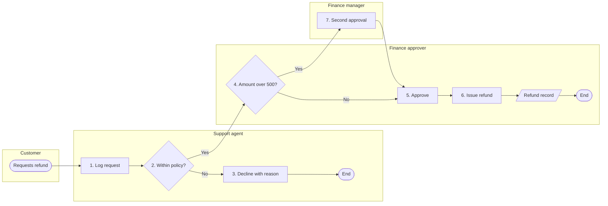
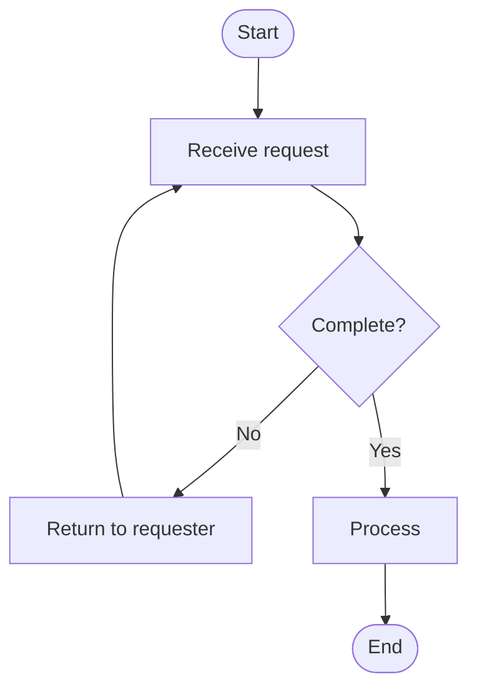
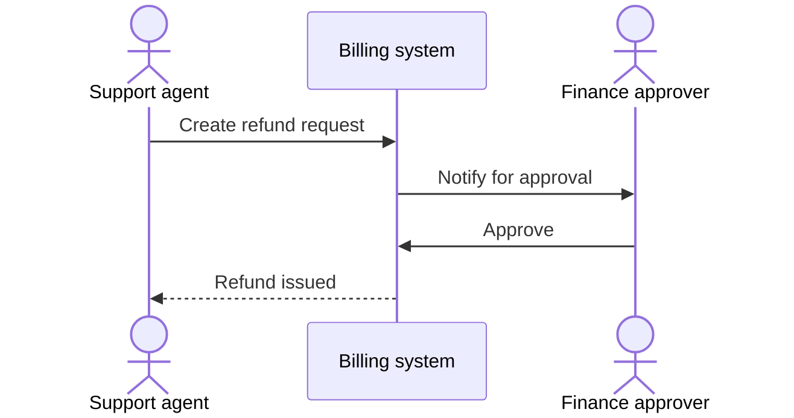

# Process maps in Mermaid

Mermaid has no native swimlane diagram. The common workaround is a
`flowchart` with one `subgraph` per role. It renders on GitHub, GitLab and
most docs sites.

## Conventions

| Shape | Mermaid | Meaning |
|---|---|---|
| Rounded | `A([Start])` | Start or end event |
| Rectangle | `B[Check invoice]` | Activity: verb + object |
| Diamond | `C{Over 500?}` | Decision: a yes/no question |
| Parallelogram | `D[/Refund record/]` | Document or record produced |
| Cylinder | `E[(Billing DB)]` | System of record |

- Label every edge out of a decision (`-->|Yes|`, `-->|No|`).
- Number activities to match the SOP steps (`S3[3. Approve refund]`) so the
  map and the table stay in sync.
- Keep a map to about 15 nodes. Past that, split into sub-processes and
  link them.
- Flow left to right (`LR`) for swimlanes, top to bottom (`TB`) for simple
  flows.

## Swimlane pattern

Declare the nodes inside the subgraph for the role that performs them, and
draw cross-lane edges after all subgraphs. Mermaid places a node in the
first subgraph that mentions it.

## Simple flowchart pattern

## Sequence pattern (hand-offs between systems and people)

Use a `sequenceDiagram` when the order of messages matters more than the
decisions:

## Checks

- Every decision has all its exits labelled.
- Every path reaches an end event.
- Every lane is a role that appears in the SOP's roles section.
- Every numbered activity matches a step in the SOP table.
