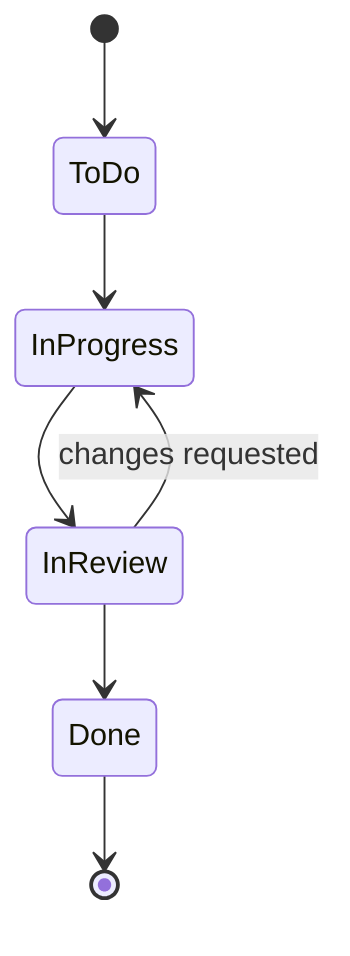

<!--
Template: Jira setup design (also usable for Linear or GitHub Projects)
Basis: common Jira administration practice. Tool details in
${CLAUDE_PLUGIN_ROOT}/skills/delivery-ops/reference/tool-jira.md and
${CLAUDE_PLUGIN_ROOT}/skills/delivery-ops/reference/tool-others.md.
Use when: designing the issue-type hierarchy, fields, workflow and board for
a team before an admin configures it.
Rules: fewest issue types and statuses that the team really distinguishes;
every custom field has a reason and an owner; check plan limits.
Remove this comment in the finished document.
-->

# Tracker setup: <Team>

| Field | Value |
|---|---|
| Tool | <Jira Cloud / Jira Data Center / Linear / GitHub Projects> |
| Plan / edition | <Free / Standard / Premium / Enterprise; check> |
| Project type | <company-managed / team-managed> |
| Project key | <KEY> |
| Team | <size, roles> |
| Way of working | <Scrum, N-week sprints / Kanban> |
| Admin | <role who applies this> |
| Status | <Draft / Agreed / Applied> |

## Hierarchy

| Level | Issue type | Available on our plan? | Notes |
|---|---|---|---|
| Above epic | <Initiative> | <Yes via Plans (Premium) / No: use labels or a separate project> | |
| 1 | Epic | Yes | |
| 0 | Story, Task, Bug, <Spike> | Yes (<Spike is custom>) | |
| -1 | Sub-task | Yes | |

## Issue types

| Type | Used for | Required fields | Description template |
|---|---|---|---|
| Story | User-facing slice | Summary, AC, Requirement ID, Story Points | Story statement + AC |
| Task | Technical work | Summary, Done-when | What/why + checklist |
| Bug | Defects | Summary, Steps, Expected, Actual, Severity | Bug template |
| <Spike> | Time-boxed research | Summary, Question, Time box | Spike template |

## Fields

| Field | Type | Applies to | Why we need it | Owner |
|---|---|---|---|---|
| Story Points | Number | Story, Task, Bug | Velocity and forecasting | Team |
| Requirement ID | Text or labels | Epic, Story | Traceability to PRD | Product owner |
| Severity | Select | Bug | Impact, separate from priority | QA |
| Components | Built-in | All | Area ownership: <list> | Eng. lead |
| Fix Version | Built-in | All | Release tracking | Product owner |

**Components:** <list with owners>. **Label conventions:** <e.g. `req-FR-###`,
`spike`, `tech-debt`; lower-case, hyphenated>.

## Workflow

| Status | Category | Entry rule | Exit rule |
|---|---|---|---|
| To Do | To Do | Meets Definition of Ready (for sprint items) | Someone starts it |
| In Progress | In Progress | Assignee set | PR open |
| In Review | In Progress | PR open | Approved and merged |
| Done | Done | Meets Definition of Done; resolution set | — |

Blocked: <flag, not a status>.

## Board

| Setting | Value |
|---|---|
| Type | <Scrum / Kanban> |
| Filter (JQL) | `project = <KEY> ORDER BY Rank ASC` |
| Columns | <To Do, In Progress, In Review, Done> |
| WIP limits | <In Progress: team size; In Review: 3> |
| Swimlanes | <by epic / by assignee / none> |
| Estimation | <Story Points> |
| Sprint length | <2 weeks> |
| Quick filters | <My issues; Bugs; Blocked> |

## Saved filters and dashboards

| Name | JQL | Used by |
|---|---|---|
| Open epics | `project = <KEY> AND issuetype = Epic AND statusCategory != Done` | Product owner |
| Needs estimate | `project = <KEY> AND issuetype = Story AND "Story Points" is EMPTY AND statusCategory = "To Do"` | Refinement |

## Automation

| When | Then |
|---|---|
| <All sub-tasks done> | <Move parent to In Review> |
| <PR merged> | <Transition to Done if DoD checks pass> |

## Migration and import

<Existing issues to move; CSV import plan; test import first.>

## Open questions

- <question; who decides>
