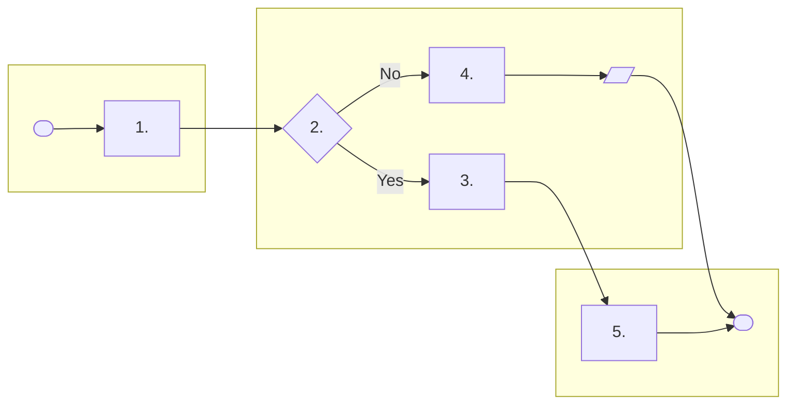

<!--
Template: Process map (swimlane)
Basis: cross-functional (swimlane) flowchart practice, drawn as a Mermaid
flowchart with one subgraph per role. Conventions are in
${CLAUDE_PLUGIN_ROOT}/skills/delivery-ops/reference/process-maps.md.
Use when: a process has three or more roles or any decision branch.
Embed in the SOP, or keep alongside it and link.
Remove this comment in the finished document.
-->

# Process map: <Process name>

| Field | Value |
|---|---|
| Related SOP | <SOP-<NNN>> |
| Owner | <role> |
| Version | <matches the SOP version> |

## Map

## Legend

| Shape | Meaning |
|---|---|
| Rounded | Start or end |
| Rectangle | Activity (numbered to match the SOP step) |
| Diamond | Decision; every exit labelled |
| Parallelogram | Record or document produced |

## Checks

- [ ] Every lane is a role in the SOP's roles section.
- [ ] Every numbered activity matches an SOP step.
- [ ] Every decision exit is labelled.
- [ ] Every path reaches an end.
