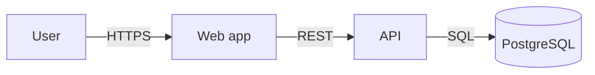

# Docs as code

Treat documentation like code: plain text, in the same repository, changed
in the same pull request, reviewed, linted, and built by CI. Docs kept in a
wiki beside the code drift from it within months.

## Principles

1. **Same repo, same PR.** A change to behaviour and the change to its docs
   ship together. Reviewers reject a PR that changes behaviour without them.
2. **Plain text.** Markdown for prose. Mermaid for diagrams. YAML for
   OpenAPI. All diffable.
3. **Reviewed like code.** Docs go through pull requests. CODEOWNERS can
   require a reviewer for `docs/`.
4. **Linted in CI.** Formatting, prose style, and links are checked
   automatically, so review time goes to substance.
5. **Versioned with the code.** A tag of the code is a tag of its docs. The
   docs for v2.3 are the docs at the v2.3 tag.
6. **Generated where possible.** API reference from OpenAPI, CLI reference
   from `--help`, config reference from the schema. Hand-written reference
   drifts.

## Markdown

Use CommonMark with GitHub Flavored Markdown extensions (tables, task lists,
fenced code). Conventions:

- One sentence per line, or wrap at 80 to 100 columns. Pick one per repo.
  One sentence per line gives cleaner diffs.
- ATX headings (`#`), one `#` title per file.
- Fenced code blocks with a language tag: ```` ```bash ````.
- Relative links between docs: `[ADR 0007](../adr/0007-use-postgres.md)`.

## Diagrams with Mermaid

GitHub, GitLab, and most docs site generators render Mermaid fenced blocks.
Diagrams live in the Markdown file, so they are reviewed with the text.



Useful diagram types: `flowchart` (architecture, flows), `sequenceDiagram`
(request flows), `erDiagram` (data models), `stateDiagram-v2` (lifecycles),
`C4Context` and related (C4, still marked experimental in Mermaid; the
flowchart form in the C4 template works everywhere), `gantt` (release plans).

For diagrams Mermaid cannot express, use a text-based tool whose source is
committed (PlantUML, Structurizr DSL, D2), or commit the editable source
file (for example a `.drawio` file) beside the exported image.

## Linting

| Tool | Checks | Config file |
|---|---|---|
| markdownlint (`markdownlint-cli2`) | Markdown structure: heading order, list style, trailing spaces | `.markdownlint.jsonc` |
| Vale | Prose style: banned words, passive voice, terminology | `.vale.ini` plus a `styles/` folder |
| lychee or markdown-link-check | Broken links | `lychee.toml` |
| cspell or codespell | Spelling, with a project word list | `cspell.json` |
| Spectral or Redocly CLI | OpenAPI validity and API style rules | `.spectral.yaml` / `redocly.yaml` |
| Prettier | Markdown and YAML formatting | `.prettierrc` |

Starting `.markdownlint.jsonc`:

```jsonc
{
  "default": true,
  "MD013": false,          // line length: off if using one sentence per line
  "MD024": { "siblings_only": true },
  "MD033": { "allowed_elements": ["br", "details", "summary"] }
}
```

Starting `.vale.ini`:

```ini
StylesPath = .github/vale
MinAlertLevel = suggestion
Packages = Google, write-good

[*.md]
BasedOnStyles = Vale, Google, write-good
```

Add a project vocabulary (`.github/vale/config/vocabularies/Project/accept.txt`)
so product names are not flagged. Run `vale sync` once to download packages.

## CI

A docs job runs on every pull request that touches `**/*.md`, `docs/**`, or
the OpenAPI file:

```yaml
name: docs
on:
  pull_request:
    paths: ['**/*.md', 'docs/**', '**/openapi.yaml']
jobs:
  lint:
    runs-on: ubuntu-latest
    steps:
      - uses: actions/checkout@v4
      - uses: DavidAnson/markdownlint-cli2-action@v16
        with:
          globs: '**/*.md'
      - uses: errata-ai/vale-action@v2
        with:
          files: docs
      - uses: lycheeverse/lychee-action@v2
        with:
          args: --no-progress './**/*.md'
```

Check action versions against their repositories before use; pin to a
release or a commit SHA.

Start with markdownlint and link checking as blocking, and Vale as
non-blocking warnings. Make Vale blocking once the backlog is clean.

## Docs sites

A site is optional. GitHub renders Markdown and Mermaid in the repo, which
is enough for most internal engineering docs. When users outside the team
read the docs, common generators are MkDocs with Material, Docusaurus,
Starlight (Astro), and VitePress. Pick the one matching the repo's language
ecosystem. Build the site in CI and fail on broken links.

## ADR tooling

Optional helpers: `adr-tools` (shell, Nygard format) and `log4brains`
(MADR, with a static site). A plain folder with a numbered file per decision
and an index in `docs/adr/README.md` works without any tool.

## Ownership

Add `docs/` paths to `.github/CODEOWNERS`:

```
/docs/adr/           @org/architecture
/docs/operations/    @org/sre
/docs/api/           @org/api-owners
```
