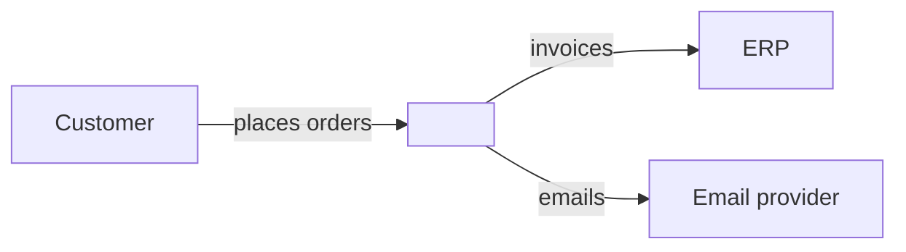
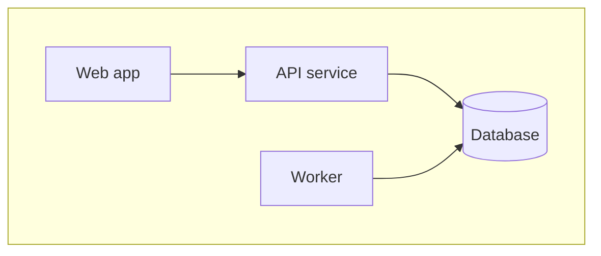
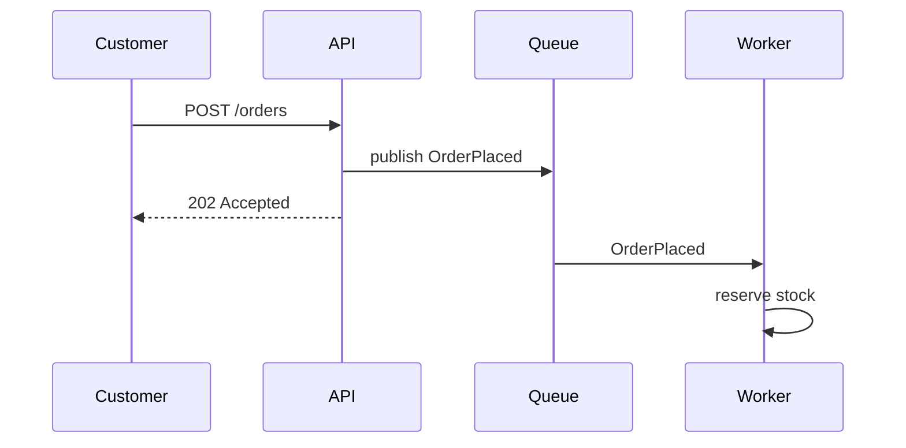
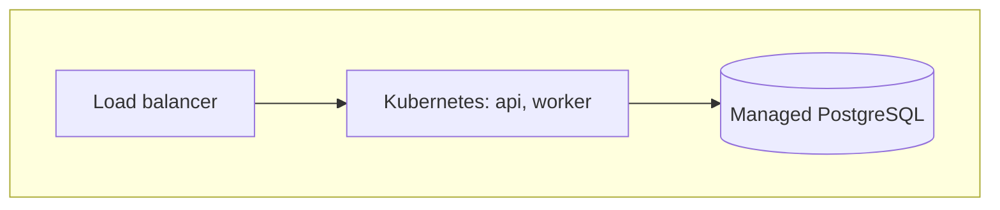

<!--
Template: Architecture documentation, arc42 structure
Basis: follows the 12 sections of the arc42 template (arc42.org, by Gernot
Starke and Peter Hruschka, licensed CC BY-SA 4.0). Section guidance here is
paraphrased. See arc42.org and docs.arc42.org for full help.
Use when: documenting a whole system's architecture for the long term.
Keep it current; small sections that are true beat full sections that are not.
Lives at: docs/architecture/architecture.md, or one file per section in
docs/architecture/.
Remove this comment in the finished document.
-->

# Architecture: <System name>

| Status | Draft |
|---|---|
| Owner | <architect or team> |
| Last updated | <YYYY-MM-DD> |
| Related | <ADR index, C4 diagrams, SLO docs> |

## 1. Introduction and goals

### 1.1 Requirements overview

<The few most important functional requirements, or a link to the PRD/SRS.
What the system is for, in a paragraph.>

### 1.2 Quality goals

<The top 3 to 5 quality goals, in priority order. These drive the
architecture.>

| Priority | Quality goal | Scenario |
|---|---|---|
| 1 | <e.g. Reliability> | <An order accepted is never lost, even if a node fails mid-write.> |

### 1.3 Stakeholders

| Role | Contact | Expectations of the architecture docs |
|---|---|---|
| <Developers> | <team> | <where to add a module; how services talk> |

## 2. Architecture constraints

| Type | Constraint | Background |
|---|---|---|
| Technical | <e.g. Must run on the company Kubernetes platform> | |
| Organisational | <e.g. Team of five; no dedicated DBA> | |
| Conventions | <e.g. OpenAPI-first for every public API> | |

## 3. Context and scope

### 3.1 Business context

<Who and what the system talks to, and what is exchanged, in domain terms.>

| Partner | Input | Output |
|---|---|---|
| <Customer> | <orders> | <confirmations> |

### 3.2 Technical context

<Channels and protocols to each partner.>

| Partner | Channel | Protocol / format |
|---|---|---|
| <ERP> | <HTTPS> | <REST, JSON> |

## 4. Solution strategy

<A short summary of the fundamental decisions: technology, top-level
decomposition, approaches to reach the quality goals. Link to ADRs.>

| Quality goal | Approach | ADR |
|---|---|---|
| <Reliability> | <transactional outbox for events> | <0004> |

## 5. Building block view

<Static decomposition. Level 1 is the white box of the whole system; lower
levels open up individual blocks. Use C4 container and component diagrams.>

### 5.1 Level 1: <System> white box

| Building block | Responsibility | Interfaces | Location in repo |
|---|---|---|---|
| <API service> | <one sentence> | <REST: link> | <apps/api> |

### 5.2 Level 2: <Building block> white box

<Repeat for blocks worth opening.>

## 6. Runtime view

<Important scenarios: the main use case, startup, error handling, a
complex interaction.>

### 6.1 <Scenario name>

## 7. Deployment view

<Infrastructure, environments, and which building block runs where.>

| Environment | Purpose | URL / location | Notes |
|---|---|---|---|
| <staging> | <pre-release testing> | <url> | |

## 8. Crosscutting concepts

<Patterns and rules that apply across building blocks. Include only those
that matter here.>

- **Domain model:** <link to data model>
- **Security:** <authn, authz, secrets, link to threat model>
- **Error handling:** <conventions>
- **Logging, metrics, tracing:** <conventions>
- **Configuration:** <how and where>
- **Persistence and transactions:** <approach>
- **Internationalisation:** <approach or N/A>
- **Testing:** <strategy>

## 9. Architecture decisions

<List of ADRs, or link to the ADR index. Do not repeat their content.>

| ADR | Title | Status |
|---|---|---|
| <0001> | <Record architecture decisions> | Accepted |

## 10. Quality requirements

### 10.1 Quality requirements overview

<Link to the NFR specification if one exists.>

### 10.2 Quality scenarios

| ID | Quality | Stimulus | Response | Measure |
|---|---|---|---|---|
| QS-1 | <Performance> | <500 users search at once> | <results returned> | <p95 < 500 ms> |

## 11. Risks and technical debt

| Risk or debt | Impact | Mitigation / plan | Owner |
|---|---|---|---|
| <description> | <H/M/L> | <plan> | <name> |

## 12. Glossary

| Term | Definition |
|---|---|
| <term> | <definition> |
