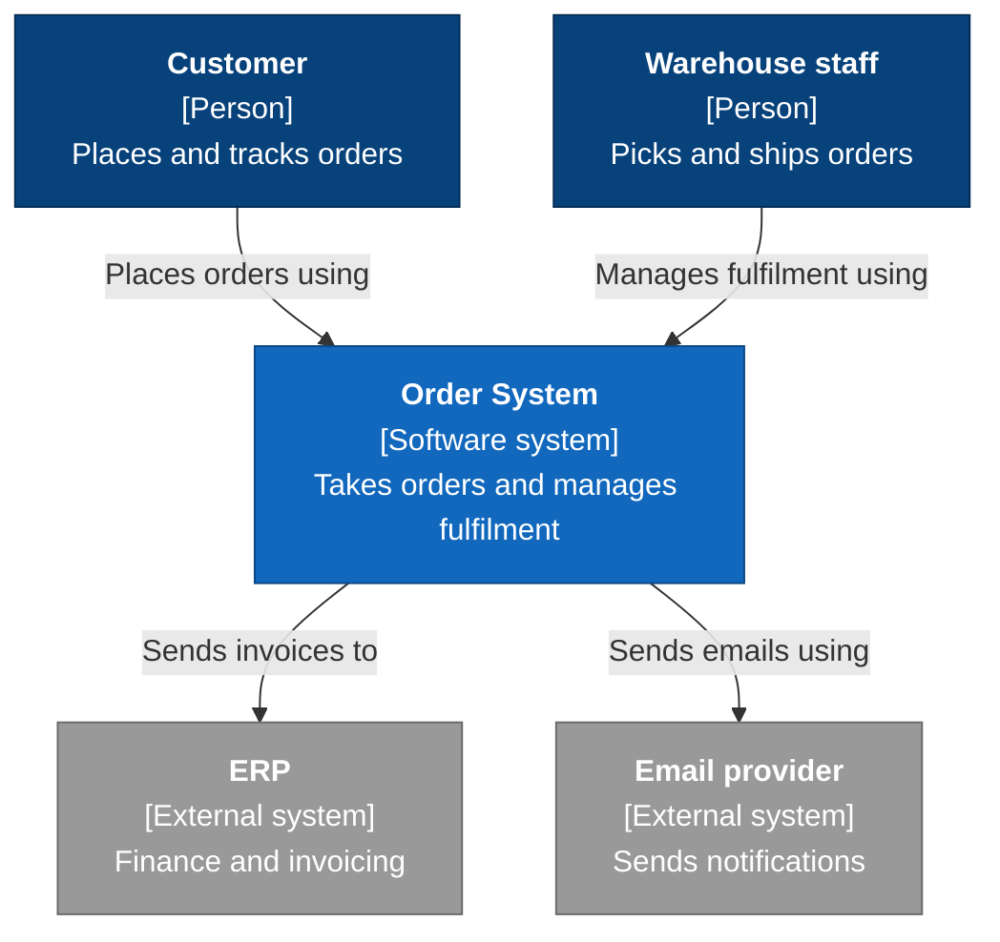
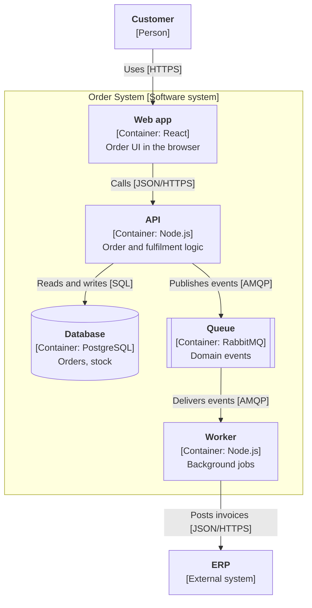
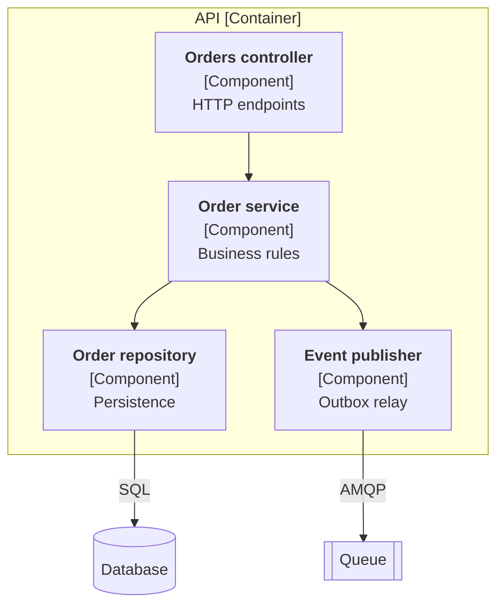
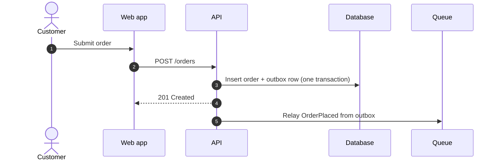
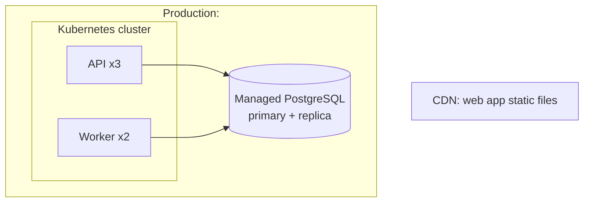
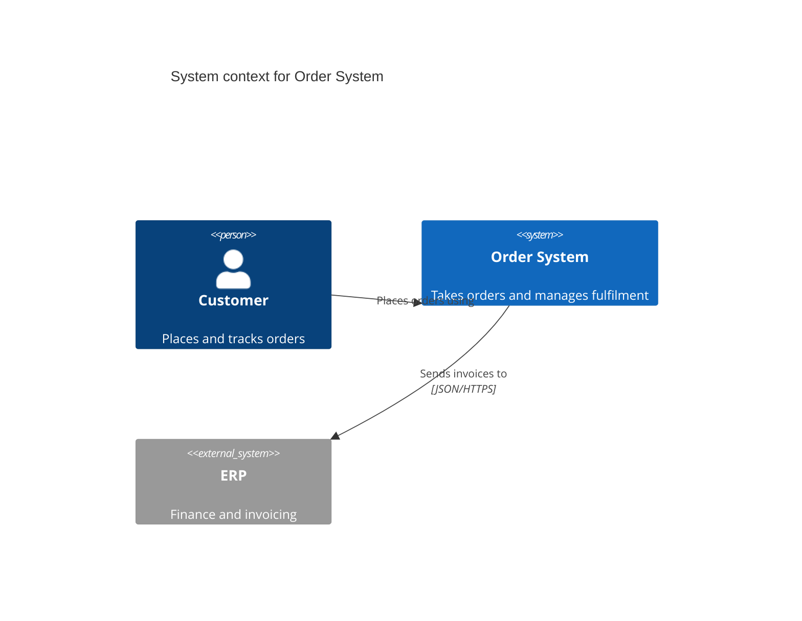

<!--
Template: C4 model architecture diagrams
Basis: Simon Brown's C4 model (c4model.com): Context, Containers,
Components, Code. Diagrams drawn in Mermaid. The flowchart form below renders
on GitHub, GitLab, and most docs sites. Mermaid also has native C4 syntax
(C4Context, C4Container), still marked experimental; an example is at the end.
Use when: someone asks "draw the architecture", or an arc42 building block
view needs diagrams.
Lives at: docs/architecture/c4-<level>.md, or inside arc42 sections 3 and 5.
Remove this comment in the finished document.
-->

# C4 diagrams: <System name>

| Status | Draft |
|---|---|
| Owner | <name> |
| Last updated | <YYYY-MM-DD> |
| Related | <arc42, ADRs> |

## How to read these diagrams

| Level | Shows | Audience |
|---|---|---|
| 1. System context | The system, its users, and the systems it talks to | Everyone, including non-technical |
| 2. Container | Deployable or runnable units: apps, services, databases, queues | Developers, operations |
| 3. Component | The main parts inside one container | Developers of that container |
| 4. Code | Classes or modules | Rarely drawn by hand; generate from code if needed |

Rules for every diagram:

- A title stating the level and scope.
- Every box has a name, a type in brackets, and a one-line responsibility.
- Every arrow is one direction and labelled with intent and, at level 2 and
  below, the protocol: "Reads orders [SQL/TCP]".
- A key for any shape or line style with meaning.
- Text below each diagram says what it shows in two or three sentences.

Most teams need levels 1 and 2. Draw level 3 only for containers that are
complex or often changed.

## Level 1: System context

<Two or three sentences: what the system does and who uses it.>

## Level 2: Containers

<Two or three sentences: the main runtime units and how they communicate.>

| Container | Technology | Responsibility | Repo path | Owner |
|---|---|---|---|---|
| <Web app> | <React> | <order UI> | <apps/web> | <team> |

## Level 3: Components of <container>

<Only for containers worth opening.>

## Supplementary: dynamic diagram

<For one important flow, show the order of interactions.>

## Supplementary: deployment

<Where containers run in one environment.>

## Mermaid native C4 syntax (optional)

Mermaid's C4 syntax is closer to C4-PlantUML, but layout control is limited
and support varies by renderer. Test it where the docs are read.

## Keeping diagrams current

- Diagrams change in the same PR as the architecture change.
- If diagrams drift often, generate them from a model (Structurizr DSL) or
  from code instead of drawing by hand.
