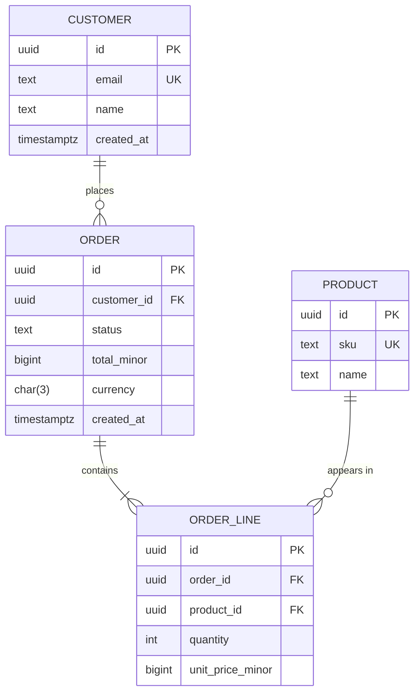

<!--
Template: Data model / ERD document
Basis: common entity-relationship modelling practice; diagram in Mermaid
erDiagram syntax (crow's foot notation).
Use when: documenting entities, relationships, constraints, and data
ownership for a service or database, or proposing a schema change.
Lives at: docs/architecture/data-model.md, or per service.
Keep the schema itself in migrations; this document explains what the
migrations cannot: meaning, ownership, rules, and retention.
Remove this comment in the finished document.
-->

# Data model: <Service or domain>

| Status | Draft |
|---|---|
| Owner | <team> |
| Database | <PostgreSQL 16, database name> |
| Schema source of truth | <path to migrations> |
| Last updated | <YYYY-MM-DD> |
| Related | <design doc, API spec, ADRs> |

## 1. Overview

<What domain this covers, which service owns the data, and who else reads
it. State whether other services may read the tables directly (usually no).>

## 2. Entity-relationship diagram

Notation: `||` exactly one, `o|` zero or one, `|{` one or more, `o{` zero or
more.

## 3. Entities

<One subsection per entity.>

### 3.1 <ORDER>

<What one row represents, in one sentence. When it is created and by whom.>

| Column | Type | Null | Default | Description / rules |
|---|---|---|---|---|
| id | uuid | no | <gen_random_uuid()> | Primary key |
| customer_id | uuid | no | | FK → customer.id, ON DELETE RESTRICT |
| status | text | no | 'draft' | One of: draft, submitted, fulfilled, cancelled |
| total_minor | bigint | no | 0 | Sum of lines, in minor currency units |
| currency | char(3) | no | | ISO 4217 code |
| created_at | timestamptz | no | now() | UTC |

**Constraints:** <check constraints, unique constraints>
**Indexes:** <index and the query it serves>
**Lifecycle:** <state diagram or link>
**Personal data:** <which columns, classification>

## 4. Business rules and invariants

<Rules the data must always satisfy, and where each is enforced (database
constraint, application, both).>

| Rule | Enforced by |
|---|---|
| <An order total equals the sum of its lines> | <application, checked nightly> |

## 5. Data ownership and access

| Entity | Owning service | Readers | Access path |
|---|---|---|---|
| <ORDER> | <orders-service> | <reporting> | <events / read replica / API> |

## 6. Volume and growth

| Entity | Rows now | Growth | Largest query |
|---|---|---|---|
| <ORDER> | <2M> | <+50k/month> | <list by customer, newest first> |

## 7. Retention, privacy, and deletion

| Data | Classification | Retention | Deletion method |
|---|---|---|---|
| <customer.email> | <Personal> | <while account active + 30 days> | <anonymise on erasure request> |

## 8. Migrations

<How schema changes are made and deployed. Expand/contract pattern for
zero-downtime changes. Link to the migrations folder.>

## 9. Open questions

| Question | Owner | Due |
|---|---|---|
| <question> | <name> | <YYYY-MM-DD> |
