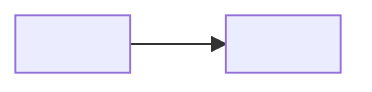

<!--
Template: Design doc / RFC
Basis: adapted from the Google-style design doc as described publicly by
Google engineers (context and scope, goals and non-goals, the design,
alternatives considered, cross-cutting concerns), combined with common RFC
process practice (status, review period, decision).
Use when: a change needs review before building: several weeks of work,
several teams, a new service or dependency, or a hard-to-reverse choice.
Not for: a single decision already made (use an ADR), or a small change
(use the PR description).
Lives at: docs/design/NNNN-<slug>.md
Length: 3 to 10 pages is typical. Longer usually means the scope is too big.
Remove this comment in the finished document.
-->

# <Title: what is being built or changed>

| Status | Draft |
|---|---|
| Author(s) | <names> |
| Reviewers | <names; include one person outside the team> |
| Approver | <name who makes the final call> |
| Review deadline | <YYYY-MM-DD> |
| Created | <YYYY-MM-DD> |
| Last updated | <YYYY-MM-DD> |
| Related | <PRD, issue, ADRs this will produce> |

## Summary

<One paragraph: the problem, the proposed approach, and what you want from
reviewers. "We propose X to solve Y. We need a decision on Z by DATE.">

## Context and scope

<What exists today and what is changing. Enough background for a reviewer
outside the team. Link rather than repeat. A context diagram helps.>

## Goals

- <Goal, stated as an outcome that can be checked.>

## Non-goals

- <Things that could reasonably be goals but are deliberately excluded.
  Not "we will not rewrite the universe", but real temptations.>

## Proposed design

### Overview

<The approach in a few paragraphs, with a diagram.>

### Detailed design

<The parts reviewers need to evaluate: components, responsibilities, data
flow, algorithms, state. Focus on trade-offs and on anything
non-obvious. Code only where it clarifies an interface.>

### APIs and interfaces

<New or changed APIs, events, CLI, config. Link to the OpenAPI file. Note
backward compatibility.>

### Data

<New or changed schemas, storage, volume estimates, retention, migration.>

### Dependencies

<New services, libraries, vendors, and teams this depends on.>

## Alternatives considered

<At least two real alternatives, including "do nothing" where it is
realistic. For each: what it is, its trade-offs, and why this design was
preferred. This section is often the most useful to reviewers.>

### Alternative 1: <name>

<Description. Pros. Cons. Why not chosen.>

### Alternative 2: <name>

<Description. Pros. Cons. Why not chosen.>

## Cross-cutting concerns

### Security and privacy

<New trust boundaries, authn/authz, personal data, secrets. Link to a
threat model if one is needed.>

### Reliability and failure modes

<What fails, how it is detected, what the user sees, how it recovers.>

### Performance and scale

<Expected load, limits, capacity estimates with the arithmetic shown.>

### Observability

<Metrics, logs, traces, alerts, dashboards. What SLO does this affect?>

### Cost

<Infrastructure and licence cost, before and after.>

### Accessibility and localisation

<If user-facing. Or N/A with reason.>

## Testing

<How the design will be verified: unit, integration, load, migration
rehearsal. Link to the test plan if one exists.>

## Rollout and rollback

<Phases, feature flags, migration steps, and the exact way back if a step
fails. State whether each step is reversible.>

| Step | Reversible? | Rollback |
|---|---|---|
| <1. Add nullable column> | Yes | <drop column> |

## Milestones

| Milestone | Scope | Target date |
|---|---|---|
| <M1> | <description> | <YYYY-MM-DD> |

## Open questions

| Question | Owner | Resolution |
|---|---|---|
| <question> | <name> | <open / answer> |

## Decision

<Filled in by the approver at the end of review.>

- Outcome: <Accepted | Accepted with changes | Rejected | Deferred>
- Date: <YYYY-MM-DD>
- ADRs recorded: <links>
- Notes: <conditions or changes required>
