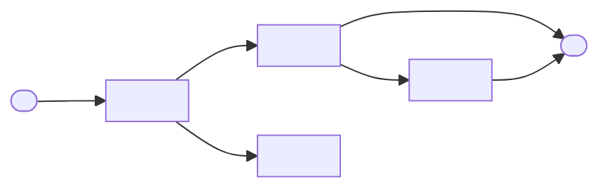

<!--
Template: Functional Specification (FS / FSD)
Basis: Adapted from common industry FSD practice; complements ISO/IEC/IEEE 29148 (see the SRS template).
This template does not reproduce any standard, and filling it in does not
make a document conformant.
Use when: stakeholders (product, business, design, QA, engineering) need to
agree WHAT the system does, from the user's and the business's point of
view, screen by screen and function by function.
Place in the chain: PRD (why, for whom) → FS (what, per screen and
function) → SRS (formal, numbered requirements) or TS (how one feature is
built) → SDD or design doc → test plan.
Not for: the business case (use a BRD or PRD), implementation detail such
as tables, endpoints, or jobs (use a technical spec), or contractual
requirements that must be formally traced (use an SRS).
Lives at: docs/product/fs-<slug>.md
Remove this comment in the finished document.
-->

# Functional Specification: <Feature or module name>

## Document control

| Status | Draft |
|---|---|
| Version | <0.1> |
| Owner | <business analyst or product owner> |
| Approvers | <product owner, business owner, engineering lead, QA lead> |
| Created | <YYYY-MM-DD> |
| Last updated | <YYYY-MM-DD> |
| Related | <PRD, SRS, technical spec, design files, epic> |

### Change history

| Version | Date | Author | Change |
|---|---|---|---|
| 0.1 | <YYYY-MM-DD> | <name> | Created |

## 1. Purpose and scope

<One paragraph: which feature or module this specifies, and who reads it.
Someone who reads only this section should know what it covers.>

**In scope:**

- <function, screen, or report covered>

**Out of scope:**

- <explicit exclusion, and where it is covered instead>

## 2. References

| Reference | Link | Notes |
|---|---|---|
| PRD | <link> | <the goals and requirements this FS elaborates> |
| Designs / prototype | <Figma or other link> | <version or frame> |
| SRS | <link, or N/A — reason> | |
| Technical spec | <link, or TBD> | |
| Other | <policy, regulation, integration spec> | |

## 3. Actors and roles

| Actor / role | Description | Typical tasks | Access level |
|---|---|---|---|
| <e.g. Accounts clerk> | <who they are> | <creates and edits invoices> | <own branch only> |
| <e.g. Finance manager> | <who they are> | <approves invoices over limit> | <all branches> |
| <e.g. Scheduler (system)> | <automated actor> | <runs nightly export> | <service account> |

## 4. Functional overview

<A short description of how the functions fit together, then a flow of the
main user journey. Label every arrow.>



### Function list

| ID | Name | Primary actor | Screen | Priority |
|---|---|---|---|---|
| F-01 | <name> | <role> | <SCR-01> | <Must / Should / Could> |
| F-02 | <name> | <role> | <SCR-02> | <Must> |

## 5. Functions

<Repeat this block for every function in the list. Keep IDs stable once the
document is In review: tests and tickets point at them.>

### F-01: <Function name>

**Description:** <What the function lets the actor do, and the business
outcome, in two or three sentences.>

**Trigger:** <The user action or system event that starts it, e.g. "User
clicks Export on the invoice list" or "Nightly at 02:00 local time".>

**Preconditions:**

- <e.g. User is signed in with the Accounts clerk role.>
- <e.g. At least one invoice matches the filter.>

**Main flow:**

1. <Actor does …>
2. <System shows / validates / saves …>
3. <System confirms with message "…">

**Alternate flows:**

- **A1 — <name>:** at step <n>, <condition>. <What happens instead, and
  where the flow rejoins.>

**Exception flows:**

- **E1 — <name>:** at step <n>, <error condition>. <What the system does,
  what the user sees, and whether anything is saved.>

**Business rules:**

| ID | Rule |
|---|---|
| BR-01 | <e.g. An invoice over 50,000 needs finance manager approval before posting. Source: <policy link or owner>.> |

**Inputs and validations:**

| Field | Type | Required | Rules | Error message |
|---|---|---|---|---|
| <Invoice date> | <Date> | Yes | <Not in a closed period; not in the future> | "<Invoice date must be in an open period.>" |
| <Amount> | <Decimal (2 dp)> | Yes | <Greater than 0; max 9,999,999.99> | "<Enter an amount greater than zero.>" |
| <Notes> | <Text, max 500> | No | <Trimmed; no HTML> | "<Notes must be 500 characters or fewer.>" |

**Outputs:**

<What the function produces: records created or changed (in business
terms), files, on-screen results, messages.>

**UI / screen reference:** <SCR-01, design link and frame. List the states
the screen must handle: empty, loading, error, no permission, large data.>

**Permissions by role:**

| Role | View | Create | Edit | Delete | Approve |
|---|---|---|---|---|---|
| <Accounts clerk> | Yes | Yes | <Own, while Draft> | No | No |
| <Finance manager> | Yes | Yes | Yes | <Draft only> | Yes |

**Audit and notification side effects:**

- **Audit:** <what is logged: who, what, when, old and new values.>
- **Notifications:** <who is told, by which channel, with what content. Link
  to the notification in section 6.>

**Acceptance criteria:**

```gherkin
Scenario: <happy path>
  Given <precondition>
  When <action>
  Then <observable outcome>

Scenario: <validation failure>
  Given <precondition>
  When <action with invalid input>
  Then <error message shown and nothing saved>
```

### F-02: <Function name>

<Same block as F-01.>

## 6. Reports and notifications

### Reports

| ID | Report | Audience | Filters | Columns | Frequency / trigger | Format |
|---|---|---|---|---|---|---|
| RPT-01 | <name> | <role> | <date range, branch> | <list> | <on demand / monthly> | <screen, CSV, PDF> |

### Notifications

| ID | Event | Recipient | Channel | Content summary | Timing |
|---|---|---|---|---|---|
| NTF-01 | <invoice awaiting approval> | <finance manager> | <email, in-app> | <invoice number, amount, link> | <immediately> |

## 7. Data dictionary

<Business terms, as users and the business understand them. Not database
columns: those belong in the technical spec or data model.>

| Term | Definition | Example | Source of truth |
|---|---|---|---|
| <Open period> | <An accounting period in which postings are allowed> | <2026-09> | <Finance calendar> |

## 8. Non-functional notes that affect behaviour

<Only the quality requirements a user or tester would notice. Link to the
NFR spec for the full set.>

- <e.g. Export of up to 10,000 rows completes on screen; larger exports run
  in the background and the user is notified.>
- <e.g. All dates shown in the user's time zone.>
- <e.g. Screens meet WCAG 2.2 AA.>

## 9. Assumptions and dependencies

| Type | Description | Owner | Impact if wrong |
|---|---|---|---|
| Assumption | <description> | <name> | <impact> |
| Dependency | <other team, system, vendor, data> | <name> | <impact> |

## 10. Open questions

| # | Question | Owner | Due | Resolution |
|---|---|---|---|---|
| 1 | <question> | <name> | <YYYY-MM-DD> | <open / answer> |

## 11. Traceability matrix

<Every PRD or SRS requirement maps to at least one function, and every
function to at least one test case. A blank cell is a gap to close.>

| Requirement ID | Function ID | Test case ID |
|---|---|---|
| <FR-1 (PRD)> | <F-01> | <TC-001, TC-002> |
| <FR-2 (PRD)> | <F-02> | <TBD> |

## 12. Sign-off

| Name | Role | Decision | Date |
|---|---|---|---|
| <name> | Product owner | <Approved / Approved with changes / Rejected> | |
| <name> | Business owner | | |
| <name> | Engineering lead | | |
| <name> | QA lead | | |
