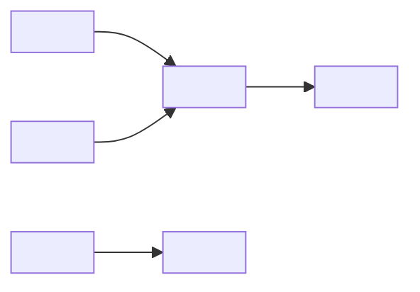

<!--
Template: Incident postmortem (blameless)
Basis: adapted from the postmortem practice described in Google's
"Site Reliability Engineering" (O'Reilly, 2016), chapter on postmortem
culture, and its example postmortem. Paraphrased; not a copy.
Use when: after any incident that affected users, breached an SLO, needed
an on-call intervention beyond the runbook, or nearly did. Start within 24
hours; publish within 5 working days.
Rule: blameless. Describe what the system and process allowed, not who
failed. People named in the timeline are named for context only.
Lives at: docs/operations/postmortems/<YYYY-MM-DD>-<slug>.md
Remove this comment in the finished document.
-->

# Postmortem: <Short title describing the user impact>

| Status | Draft |
|---|---|
| Incident ID | <INC-123> |
| Date of incident | <YYYY-MM-DD> |
| Authors | <names> |
| Reviewers | <names> |
| Severity | <SEV-1 / SEV-2 / SEV-3> |
| Incident commander | <name> |

Status values: Draft → In review → Published → Closed (all actions done).

## Summary

<Three to five sentences: what happened, how long, who was affected, the
root cause in one line, and how it was resolved.>

## Impact

| Measure | Value |
|---|---|
| Duration (user impact) | <HH:MM, from start to full recovery> |
| Users / customers affected | <number or percentage> |
| Requests failed | <number or percentage> |
| Revenue / orders affected | <amount or N/A> |
| Data lost or corrupted | <none / description> |
| SLO budget consumed | <percentage of monthly budget> |
| Support tickets | <number> |

## Detection

<How was it detected: alert, customer, employee? How long after it began?
Did the alert fire as expected?>

## Response and recovery

<What was done to mitigate and resolve. What went well, what slowed it down.>

## Timeline

All times UTC.

| Time | Event |
|---|---|
| <YYYY-MM-DD HH:MM> | <Deploy of version X starts> |
| <HH:MM> | <Error rate rises; alert fires (start of impact)> |
| <HH:MM> | <On-call acknowledges> |
| <HH:MM> | <Incident declared, IC assigned> |
| <HH:MM> | <Mitigation applied: rollback> |
| <HH:MM> | <Recovery confirmed (end of impact)> |

## Root cause and trigger

**Trigger:** <The event that started the incident, e.g. a config change.>

**Root cause(s):** <The underlying conditions that let the trigger cause
harm. Usually more than one. Ask "why" until you reach something the team can
change: a missing check, an unsafe default, a gap in testing.>

**Contributing factors:** <Things that made it worse or slower to fix.>

## Lessons learned

### What went well

- <e.g. Rollback took 4 minutes and worked first time.>

### What went wrong

- <e.g. The alert threshold was too high; users noticed first.>

### Where we got lucky

- <e.g. It happened at low traffic. At peak, impact would be 5×.>

## Action items

<Each action prevents recurrence, reduces impact, or speeds detection or
recovery. Each has an owner, a ticket, and a due date. "Be more careful" is
not an action item.>

| # | Action | Type | Priority | Owner | Ticket | Due |
|---|---|---|---|---|---|---|
| 1 | <Add migration check to deploy pipeline> | Prevent | P1 | <name> | <link> | <YYYY-MM-DD> |
| 2 | <Lower error-rate alert threshold to 2%> | Detect | P2 | <name> | <link> | <YYYY-MM-DD> |
| 3 | <Update runbook with rollback command> | Mitigate | P2 | <name> | <link> | <YYYY-MM-DD> |

## Supporting information

<Links: incident channel, dashboards, graphs, related postmortems, PRs.>
