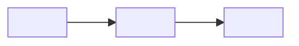
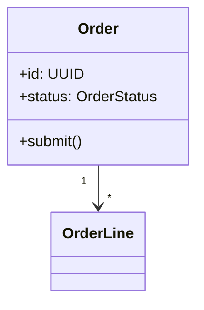
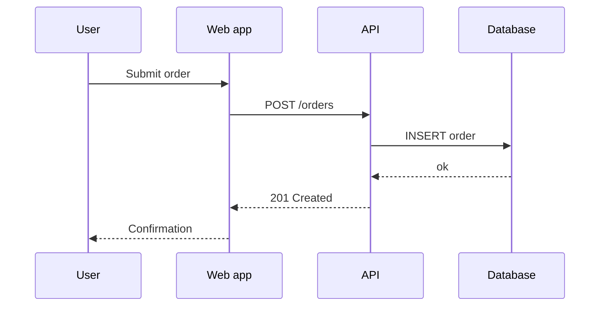
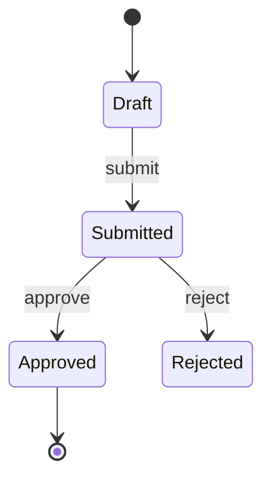

<!--
Template: Software Design Description (SDD)
Basis: based on the design viewpoints described in IEEE 1016-2009 (context,
composition, logical, dependency, information, patterns, interface, structure,
interaction, state dynamics, algorithm, resource). This template does not
reproduce the standard or make a document conformant to it.
Use when: a formal design description is a deliverable (regulated,
contractual, or large multi-team work). For most product teams, arc42 plus
ADRs, or a design doc, is enough.
Lives at: docs/architecture/sdd-<system>.md
Remove this comment in the finished document.
-->

# Software Design Description: <System name>

| Status | Draft |
|---|---|
| Version | <0.1> |
| Owner | <name> |
| Approvers | <names, roles> |
| Created | <YYYY-MM-DD> |
| Last updated | <YYYY-MM-DD> |
| Related | <SRS, arc42, ADRs> |

## 1. Introduction

### 1.1 Purpose

<What this SDD describes, and who reads it.>

### 1.2 Scope

<The software item and its boundaries. Which version or release.>

### 1.3 Design stakeholders and concerns

| Stakeholder | Concerns |
|---|---|
| <Developers> | <module boundaries, interfaces, build> |
| <Operations> | <deployment, resources, failure modes> |
| <Security> | <trust boundaries, data handling> |
| <Auditor / customer> | <traceability to requirements> |

<Each concern must be addressed by at least one viewpoint below.>

### 1.4 Definitions and references

| Term / Ref | Meaning / Document |
|---|---|
| <term> | <definition> |

## 2. Design viewpoints

<Include the viewpoints that address a listed concern. Mark others
`N/A — <reason>`. For each: the concern it addresses, the view (diagram
and text), and design rationale.>

### 2.1 Context viewpoint

<The system as a black box: users, external systems, services offered.>

### 2.2 Composition viewpoint

<How the system is broken into parts: subsystems, components, modules. Name
each, state its responsibility in one sentence.>

| Component | Responsibility | Owner |
|---|---|---|
| <name> | <one sentence> | <team> |

### 2.3 Logical viewpoint

<Key types, classes, and their relationships inside components.>

### 2.4 Dependency viewpoint

<What depends on what, at build and run time. Flag cycles.>

### 2.5 Information viewpoint

<Persistent data: entities, stores, ownership, retention. Link to the data
model document.>

### 2.6 Patterns use viewpoint

<Architectural and design patterns used, and where. E.g. hexagonal
architecture in the domain service, outbox pattern for events.>

### 2.7 Interface viewpoint

<Every external and major internal interface: protocol, operations, data
formats, errors. Link to API specs rather than repeating them.>

| Interface | Provider | Consumer | Protocol | Spec |
|---|---|---|---|---|
| <Orders API> | <orders-service> | <web app> | <REST/HTTPS> | <link to OpenAPI> |

### 2.8 Structure viewpoint

<Internal structure of complex components: layers, packages.>

### 2.9 Interaction viewpoint

<Key runtime scenarios as sequence diagrams.>

### 2.10 State dynamics viewpoint

<Entities or components with meaningful states.>

### 2.11 Algorithm viewpoint

<Non-obvious algorithms: pricing, allocation, scheduling. Pseudocode,
complexity, edge cases.>

### 2.12 Resource viewpoint

<CPU, memory, storage, network, licences, and how they are used and bounded.>

## 3. Design rationale

<Key decisions and why. Link to ADRs for each.>

| Decision | ADR |
|---|---|
| <description> | <link> |

## 4. Requirements traceability

| Requirement | Design element(s) |
|---|---|
| <FR-001> | <component, interface> |

## 5. Change history

| Version | Date | Author | Change |
|---|---|---|---|
| 0.1 | <YYYY-MM-DD> | <name> | Initial draft |
