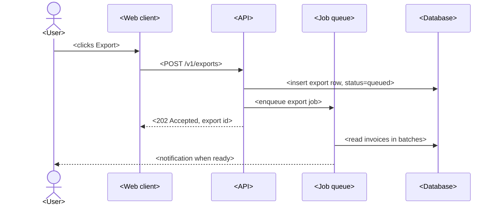

<!--
Template: Technical Specification (TS / TSD)
Basis: common engineering practice for implementation specs; no formal
standard. Lighter than the IEEE 1016-based SDD, more concrete than the
design doc.
Use when: engineers need the concrete implementation plan for ONE feature
or component: which modules change, the API and schema changes, jobs,
flags, tests, rollout, and a task breakdown that can become tickets.
Write a TS instead of a design doc when the approach is already agreed (or
obvious) and what is missing is the build plan. Write a design doc first
when the approach itself needs review: real alternatives, several teams,
or a hard-to-reverse choice. The TS then follows from the accepted design
doc and its ADRs.
Write a TS instead of an SDD unless a formal design description is a
contractual or regulatory deliverable covering the whole system.
Place in the chain: PRD → FS (SRS if formal) → design doc/SDD → TS → test plan.
Not for: what the user sees or why (use a functional spec or PRD), or a
single decision (use an ADR).
Lives at: docs/design/ts-<slug>.md
Remove this comment in the finished document.
-->

# Technical Specification: <Feature or component name>

## Document control

| Status | Draft |
|---|---|
| Version | <0.1> |
| Author(s) | <names> |
| Reviewers | <names; include the owner of every module touched> |
| Approver | <tech lead> |
| Created | <YYYY-MM-DD> |
| Last updated | <YYYY-MM-DD> |

### Change history

| Version | Date | Author | Change |
|---|---|---|---|
| 0.1 | <YYYY-MM-DD> | <name> | Created |

## 1. Summary

<Two or three sentences: what will be built, in which part of the system,
and the main technical change. "We will add X to service Y, backed by table
Z, behind flag F.">

## 2. Links

| Document | Link |
|---|---|
| Functional spec | <link; the function IDs this TS implements> |
| PRD | <link> |
| Design doc | <link, or N/A — approach agreed in …> |
| ADRs | <links> |
| API spec / data model | <links> |
| Epic / tickets | <link> |

## 3. Scope

**In scope:**

- <e.g. F-01 and F-02 from the functional spec>

**Out of scope:**

- <explicit exclusion, and where it is handled>

## 4. Current state

<How the affected area works today: modules, data, known limits and
debt that this work touches. Link to code paths. A reviewer new to the area
should follow the proposal after reading this.>

## 5. Proposed implementation

### 5.1 Components and modules touched

| Component / module | Path | Change | Owner |
|---|---|---|---|
| <invoice service> | <`apps/api/src/invoices/`> | <new export handler> | <team> |
| <web client> | <`apps/web/src/invoices/`> | <export button and progress UI> | <team> |

### 5.2 Sequence



### 5.3 API changes

| Method | Endpoint | Change | Auth | Compatible? |
|---|---|---|---|---|
| <POST> | </v1/exports> | <new> | <role: accounts> | <Yes / breaking — reason> |

**Request:**

```json
{ "<field>": "<type and example>" }
```

**Response:**

```json
{ "<field>": "<type and example>" }
```

**Error codes:**

| HTTP status | Code | When | Client behaviour |
|---|---|---|---|
| 400 | <INVALID_FILTER> | <filter fails validation> | <show field errors> |
| 403 | <FORBIDDEN> | <role lacks permission> | <hide action> |
| 409 | <EXPORT_RUNNING> | <an export is already running for this user> | <show existing export> |

<Update the OpenAPI file in the same PR; link it here.>

### 5.4 Data model changes

| Table / collection | Change | Nullable / default | Index |
|---|---|---|---|
| <exports> | <new table: id, user_id, status, filter, file_url, created_at> | <…> | <(user_id, created_at)> |

**Migrations:** <file names, order, and whether each is online (no lock) or
needs a window.>

**Backfill:** <what, how many rows, batch size, run time estimate with the
arithmetic, idempotent or not. Or N/A — reason.>

### 5.5 Background jobs

| Job | Trigger / schedule | Idempotent? | Retries and backoff | Timeout | Concurrency |
|---|---|---|---|---|---|
| <export-invoices> | <enqueued by API> | <Yes, keyed by export id> | <3, exponential> | <10 min> | <1 per user> |

### 5.6 Configuration and feature flags

| Name | Type | Default | Environments | Removal plan |
|---|---|---|---|---|
| <`invoices.bulk_export`> | <flag> | <off> | <staging on, prod by tenant> | <remove 2 weeks after 100%> |
| <`EXPORT_MAX_ROWS`> | <env var> | <100000> | <all> | <permanent> |

### 5.7 Security and permissions

<Who can call what; permission checks and where they run; tenant isolation;
personal data touched and its retention; secrets; input validation. Link to
a threat model if a new trust boundary is added.>

### 5.8 Performance and limits

<Expected volume and peak, with the arithmetic. Limits enforced (rows, file
size, rate). Query plans for new queries. What happens at the limit.>

### 5.9 Observability

| Kind | Name | Details |
|---|---|---|
| Log | <`export.completed`> | <fields: export_id, rows, duration_ms; no personal data> |
| Metric | <`export_duration_seconds`> | <histogram, labels: status> |
| Alert | <`ExportFailureRateHigh`> | <condition; links to runbook> |
| Dashboard | <name> | <link> |

## 6. Testing plan

| Level | What is tested | Test data | Where it runs |
|---|---|---|---|
| Unit | <filter validation, batching> | <fixtures> | <CI> |
| Integration | <API + DB + queue> | <seeded tenant with 10k invoices> | <CI> |
| End-to-end | <F-01 acceptance criteria from the FS> | <staging tenant> | <nightly> |
| Performance | <export of max rows> | <generated data set> | <staging> |

<Link the test plan if one exists. Name any data that must be anonymised.>

## 7. Rollout and rollback

| Step | Action | Reversible? | Rollback | Check before next step |
|---|---|---|---|---|
| 1 | <deploy migration> | <Yes> | <down migration> | <no lock alerts> |
| 2 | <deploy code, flag off> | <Yes> | <redeploy previous> | <error rate flat> |
| 3 | <flag on for internal tenant> | <Yes> | <flag off> | <exports succeed> |
| 4 | <flag on for all> | <Yes> | <flag off> | <SLO holds for 7 days> |

## 8. Migration steps

<Ordered steps for data or behaviour migration from the current state,
including who runs each and how progress is verified. Or N/A — reason.>

1. <step>

## 9. Risks

| Risk | Likelihood | Impact | Mitigation | Owner |
|---|---|---|---|---|
| <description> | <H/M/L> | <H/M/L> | <mitigation> | <name> |

## 10. Effort breakdown

<Tasks small enough to become tickets: one to three days each. Each task
names what "done" means. This table can be copied into the tracker.>

| # | Task | Component | Depends on | Estimate | Done when |
|---|---|---|---|---|---|
| T1 | <create exports table migration> | <API> | — | <0.5 d> | <migration merged, runs online in staging> |
| T2 | <POST /v1/exports endpoint> | <API> | T1 | <1 d> | <integration tests pass> |
| T3 | <export job> | <worker> | T1 | <2 d> | <exports 100k rows under limit in staging> |

## 11. Open questions

| # | Question | Owner | Due | Resolution |
|---|---|---|---|---|
| 1 | <question> | <name> | <YYYY-MM-DD> | <open / answer> |

## 12. Reviewers and sign-off

| Name | Role / area | Decision | Date |
|---|---|---|---|
| <name> | Tech lead | <Approved / Approved with changes / Rejected> | |
| <name> | <owner of module touched> | | |
| <name> | QA | | |
| <name> | <security, if 5.7 adds a trust boundary> | | |
