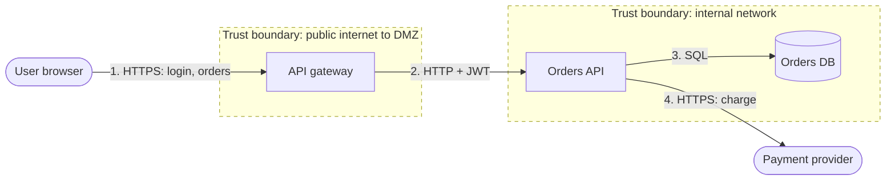

<!--
Template: Threat model (STRIDE)
Basis: STRIDE threat categories (developed at Microsoft by Loren Kohnfelder
and Praerit Garg), applied per element of a data flow diagram; organised by
the four questions from the Threat Modeling Manifesto: What are we working
on? What can go wrong? What are we going to do about it? Did we do a good
enough job?
Use when: before building anything that adds a trust boundary, handles
authentication, money, or personal data, or exposes a new endpoint. Update it
when the design changes.
Lives at: docs/architecture/threat-model-<scope>.md
Remove this comment in the finished document.
-->

# Threat model: <System or feature>

| Status | Draft |
|---|---|
| Owner | <name> |
| Participants | <engineering, security, product> |
| Created | <YYYY-MM-DD> |
| Last reviewed | <YYYY-MM-DD> |
| Next review | <YYYY-MM-DD, or "on next design change"> |
| Related | <design doc, architecture, NFR security section> |

## 1. What are we working on?

### 1.1 Scope

<What is in scope for this model, and what is not.>

### 1.2 Assets

| Asset | Why it matters | Classification |
|---|---|---|
| <customer personal data> | <privacy law, trust> | <Confidential> |
| <payment tokens> | <financial loss> | <Restricted> |
| <admin credentials> | <full compromise> | <Restricted> |

### 1.3 Data flow diagram

<Show external entities, processes, data stores, data flows, and trust
boundaries (dashed subgraphs).>

### 1.4 Assumptions

<Security assumptions this model relies on. If one is false, revisit.>

- <e.g. The cloud provider's network isolation holds.>

## 2. What can go wrong?

STRIDE categories and the property each violates:

| Category | Threat | Property violated |
|---|---|---|
| **S**poofing | Pretending to be someone or something else | Authenticity |
| **T**ampering | Modifying data or code | Integrity |
| **R**epudiation | Denying an action with no way to prove otherwise | Non-repudiation |
| **I**nformation disclosure | Exposing data to someone not allowed | Confidentiality |
| **D**enial of service | Making the system unavailable | Availability |
| **E**levation of privilege | Gaining rights not granted | Authorisation |

Consider every category for every element and flow crossing a trust
boundary. Record "not applicable" with a reason rather than skipping.

### 2.1 Threat list

| ID | Element / flow | STRIDE | Threat | Likelihood | Impact | Risk |
|---|---|---|---|---|---|---|
| T-1 | <Flow 1: user → gateway> | S | <Credential stuffing against login> | <High> | <High> | <High> |
| T-2 | <Flow 2: gateway → API> | T | <JWT forged if signing key leaks> | <Low> | <High> | <Medium> |
| T-3 | <Orders API> | R | <User disputes placing an order; no audit trail> | <Medium> | <Medium> | <Medium> |
| T-4 | <Orders DB> | I | <SQL injection exposes customer data> | <Low> | <High> | <Medium> |
| T-5 | <API gateway> | D | <Unauthenticated endpoint flooded> | <Medium> | <Medium> | <Medium> |
| T-6 | <Orders API> | E | <Customer changes another customer's order (IDOR)> | <Medium> | <High> | <High> |

<Risk rating method: state which (a simple likelihood × impact matrix, or
CVSS, or DREAD) and use it consistently.>

## 3. What are we going to do about it?

| Threat | Response | Mitigation | Status | Owner | Ticket |
|---|---|---|---|---|---|
| T-1 | Mitigate | <Rate limit per IP and account; MFA; breached-password check> | <Planned> | <name> | <link> |
| T-6 | Mitigate | <Authorisation check on every object access; tests per endpoint> | <Done> | <name> | <link> |
| T-3 | Accept | <Low value orders; revisit if disputes rise> | Accepted | <risk owner> | |

Responses: **Mitigate** (reduce), **Eliminate** (remove the feature or
flow), **Transfer** (insurance, provider), **Accept** (named risk owner
signs off).

## 4. Did we do a good enough job?

- [ ] Every element and flow crossing a trust boundary was considered for all six categories.
- [ ] Every High risk has a mitigation or a signed acceptance.
- [ ] Every mitigation has an owner and a ticket.
- [ ] Mitigations have tests or verification steps.
- [ ] A reviewer outside the team has read this.

## Change log

| Date | Author | Change |
|---|---|---|
| <YYYY-MM-DD> | <name> | Created |
