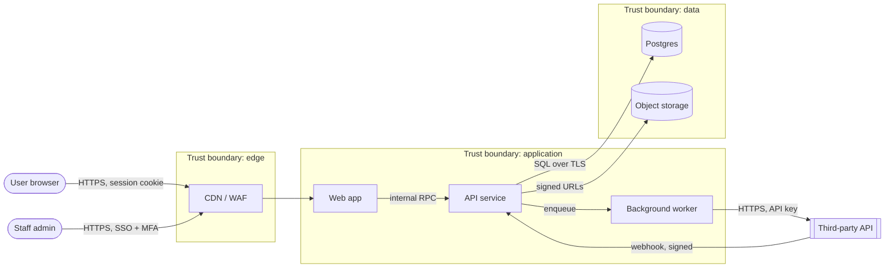

# Threat model: <system or feature>

Date: <YYYY-MM-DD> · Authors: <names> · Reviewed by: <name>
Method: STRIDE (`${CLAUDE_PLUGIN_ROOT}/skills/security-audit/reference/stride.md`)

## 1. What are we building?

<Two or three sentences: purpose, users, most sensitive data.>

## 2. Data-flow diagram

Trust boundaries are the dashed subgraphs. Every arrow crossing one gets
STRIDE analysis.

Replace with the real components. Label each flow with protocol and auth.

## 3. Elements

| ID | Element | Type (actor / process / store / flow) | Trust boundary crossed | Data classes |
|---|---|---|---|---|
| E1 | User → Web app | Flow | Internet → edge | Confidential |
| E2 | API service | Process | — | |
| E3 | Postgres | Store | app → data | |

## 4. STRIDE analysis

| Threat ID | Element | STRIDE | Threat | Existing control | Gap | Risk (L×I) | Response | Finding ID |
|---|---|---|---|---|---|---|---|---|
| T1 | E1 | S | Session hijack via stolen cookie | Secure, HttpOnly, SameSite | No session revocation on password change | Medium | Mitigate | F-003 |
| T2 | E2 | E | Tenant A reads tenant B via ID in URL | Ownership check in some handlers | Not in export handler | High | Mitigate | F-001 |
| T3 | E3 | I | App connects as DB owner, bypassing RLS | — | Owner role in use | Medium | Mitigate | F-004 |
| T4 | Webhook in | S/T | Forged webhook | — | Signature not verified | High | Mitigate | F-002 |
| T5 | E2 | D | | | | | | |
| T6 | E2 | R | | | | | | |

Response is one of: mitigate, accept (owner + expiry), transfer, eliminate.

## 5. Assumptions

- <e.g. the cloud provider's physical and hypervisor security is trusted>
- <e.g. staff laptops are managed and encrypted>

## 6. Accepted risks

| Threat ID | Reason | Owner | Review by |
|---|---|---|---|
| | | | |

## 7. Next review

<Date, or the architecture change that triggers it.>
