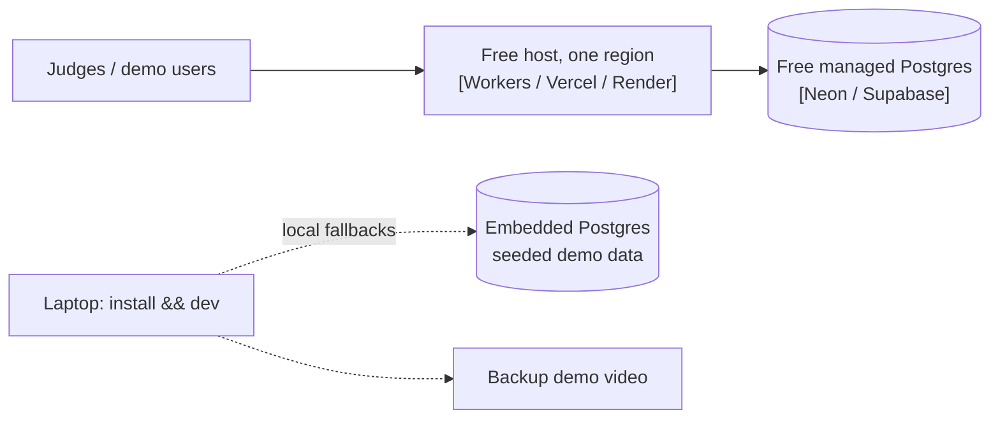
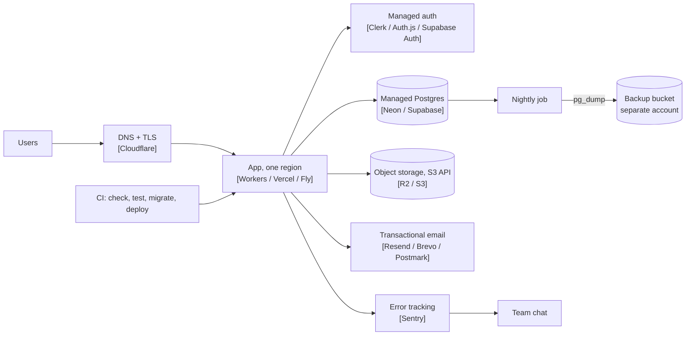
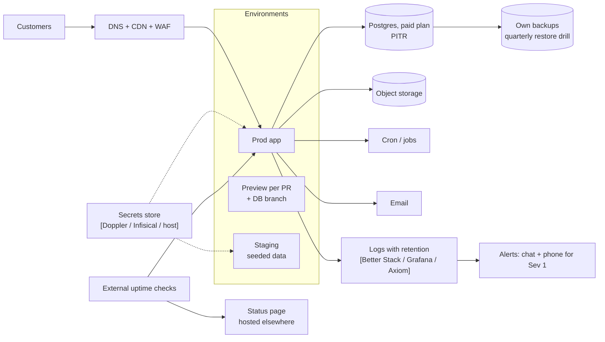
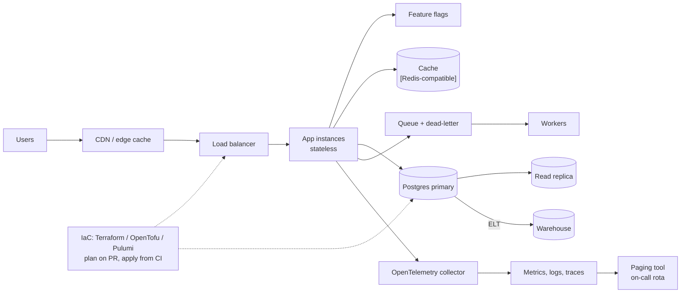
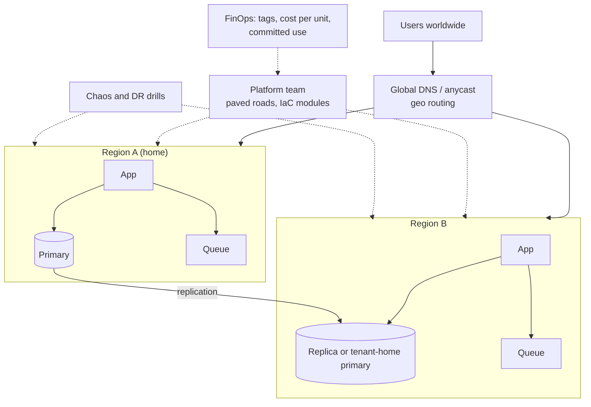

# Architecture diagram starters (Mermaid)

One diagram per stage. Copy the one for your stage, rename the boxes to your
providers, and delete what you do not run. Stage detail:
`${CLAUDE_PLUGIN_ROOT}/skills/startup-infra/reference/stages.md`.

Labels use generic layer names with an example provider in brackets. Replace
the example with your own choice from
`${CLAUDE_PLUGIN_ROOT}/skills/startup-infra/reference/layers.md`.

## Stage 0 · Hackathon

## Stage 1 · MVP / pilot

## Stage 2 · First paying customers

## Stage 3 · Growth

## Stage 4 · Scale

## Conventions

- Cylinders `[( )]` are stateful: these are what backups and DR tiers cover.
- Dashed lines are control or config paths, not user traffic.
- Keep the diagram in the repo next to the decision records; update it in the
  same PR as the infrastructure change.
